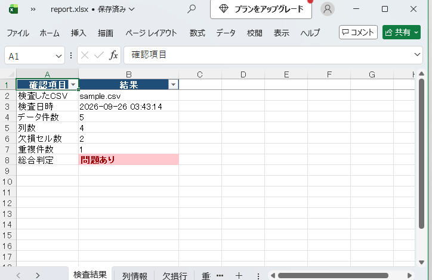

# CSV Quality Report Tool

[](https://github.com/ruru105/csv-quality-report-tool/actions/workflows/main.yml)

CSVファイルを自動検査し、データ品質の確認結果を見やすいExcelレポートとして出力するPythonツールです。

## 主な機能

- データ件数と列数の集計
- 欠損セル数の確認
- 重複行数の確認
- 各列のデータ型を確認
- 各列の有効データ数を集計
- 各列の欠損数を集計
- 各列のユニーク数を集計
- 欠損を含む行を抽出
- 重複している行を抽出
- 検査結果をExcel形式で出力
- UTF-8 / Windows系CSV文字コードに対応

## 判定ルール

以下のどちらかに該当する場合、総合判定を「問題あり」とします。

- 欠損セル数が1件以上
- 重複行数が1件以上

欠損セルと重複行がともに0件の場合は「問題なし」と判定します。

## 欠損セル数・重複件数の数え方(サンプルの例)

付属の `sample.csv` は、次の5行(見出しを除く)のデータです。

| employee_id | name | department | hours_worked |
|---|---|---|---|
| 1001 | Aoki | Care | 8 |
| 1002 | Sato | Office | 7.5 |
| 1003 | Tanaka | (空欄) | 8 |
| 1002 | Sato | Office | 7.5 |
| 1004 | Suzuki | Care | (空欄) |

- **欠損セル数 = 2**:空欄のセルの数です。Tanakaの `department` と、Suzukiの `hours_worked` の2か所です。
- **重複件数 = 1**:同じ内容の行が2回出てくるとき、2回目のぶんを1件と数えます。この例では、1002のSatoの行が2回あるので1件です。
- レポートの「重複行」シートには、同じ内容の行が、両方(この例では2行)表示されます。件数(1)と表示される行数(2)が違うのは、このためです。

## 入力ファイル

検査したいCSVは、実行するときにファイル名を指定して選べます(下の「使い方」を参照)。

何も指定しなかったときは、プロジェクトフォルダ内の以下のCSVを読み込みます。

`sample.csv`

## 出力ファイル

実行すると、Excelファイルを作成します。ファイル名を指定しなかったときは、次の名前で作成します。

`report.xlsx`

出力するファイル名も、実行するときに指定できます(下の「使い方」を参照)。

Excelレポートには次の5シートを出力します。

| シート名 | 内容 |
|---|---|
| 検査結果 | データ件数、列数、欠損セル数、重複件数、総合判定 |
| 列情報 | 各列のデータ型、有効データ数、欠損数、ユニーク数 |
| 欠損行 | 欠損値を含む行 |
| 重複行 | 重複している行 |
| 元データ | 読み込んだCSVの全データ |

Excelはヘッダー装飾、ウィンドウ固定、オートフィルタ、列幅調整を行い、確認しやすい形式で出力します。

## 出力例



## 動作環境

- Python 3.14.7
- pandas 3.0.5
- openpyxl 3.1.5

## インストール

このフォルダで次のコマンドを実行します。

```bash
python -m pip install -r requirements.txt
```

## 使い方

### 何も指定しない場合

付属の `sample.csv` を検査します。

```bash
python csv_report.py
```

数秒で終わり、次のように表示されます(付属のサンプルデータの場合)。

```text
完了：report.xlsx を作成しました。
データ件数=5 / 欠損セル数=2 / 重複件数=1 / 判定=問題あり
```

同じフォルダに `report.xlsx` が作成されます。

### 検査するCSVを指定する場合

CSVのファイル名を、コマンドの後ろに書きます。

```bash
python csv_report.py 顧客一覧.csv
```

ファイル名に空白が含まれるときや、別のフォルダにあるCSVを指定するときは、全体を引用符(")で囲みます。

```bash
python csv_report.py "data/顧客 一覧.csv"
```

### 作成するExcelの名前を指定する場合

`-o` の後ろに、作りたいExcelのファイル名を書きます。

```bash
python csv_report.py 顧客一覧.csv -o 結果.xlsx
```

### 指定したCSVが見つからない場合

次のように表示され、Excelは作成されません。

```text
エラー：nothing.csv が見つかりません。
```

## 自動テスト

pytestを使用した自動テストを実装しています。

以下の内容を自動確認します。

- UTF-8形式のCSVを正しく読み込めること
- CP932形式のCSVを正しく読み込めること
- Excelレポートが正常に生成されること
- 5つのシートが正しく作成されること
- データ件数、欠損セル数、重複件数、総合判定が期待値と一致すること
- 検査するCSVと出力するExcelの名前を、指定して実行できること
- 存在しないCSVを指定したとき、エラーを表示し、Excelを作成しないこと

テストは次のコマンドで実行できます。

```bash
python -m pytest
```

現在のテスト結果：

```text
5 passed
```

(2026-09-20 に確認)

## 現在の制限

- 空のCSV、形式が壊れたCSVを渡したときの動作は、まだ確認・対応していません。
- サンプルのデータはすべて架空です。実在の人物・組織のデータではありません。
