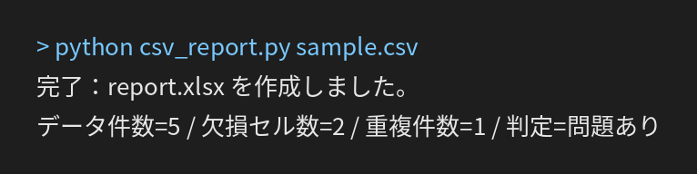
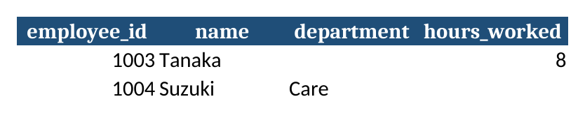
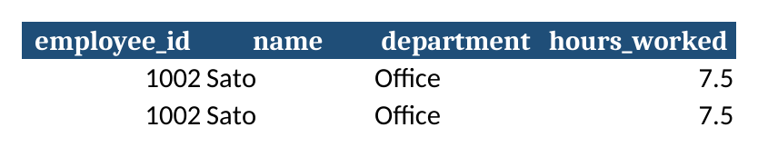
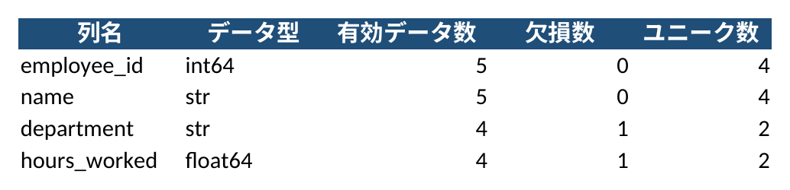

# CSVチェッカー(CSV Checker)

旧称:CSV Quality Report Tool(GitHubのリポジトリ名は`csv-quality-report-tool`のままです)。

[](https://github.com/ruru105/csv-quality-report-tool/actions/workflows/main.yml)

CSVファイルを自動検査し、データ品質の確認結果を見やすいExcelレポートとして出力するPythonツールです。

CSVを整形する `csv_clean.py` も同梱しています(下の「CSVを整形する」を参照)。

---

## 目次

- [主な機能](#主な機能)
- [判定ルール](#判定ルール)
- [欠損セル数・重複件数の数え方(サンプルの例)](#欠損セル数重複件数の数え方サンプルの例)
- [入力ファイル](#入力ファイル)
- [出力ファイル](#出力ファイル)
- [出力例](#出力例)
- [動作環境](#動作環境)
- [インストール](#インストール)
- [使い方(csv_report.py)](#使い方csv_reportpy)
- [検査ルールを設定ファイルで指定する(--config)](#検査ルールを設定ファイルで指定する--config)
- [フォルダの中のCSVをまとめて検査する(--folder)](#フォルダの中のcsvをまとめて検査する--folder)
- [検査結果をSQLiteに記録して見比べる(--history・--show-history)](#検査結果をsqliteに記録して見比べる--history--show-history)
- [CSVを整形する(csv_clean.py)](#csvを整形するcsv_cleanpy)
- [自動テスト](#自動テスト)
- [現在の制限](#現在の制限)

---

## 主な機能

- データ件数と列数の集計
- 欠損セル数の確認
- 重複行数の確認
- 各列のデータ型を確認
- 各列の有効データ数を集計
- 各列の欠損数を集計
- 各列のユニーク数を集計
- 欠損を含む行を抽出
- 重複している行を抽出
- 検査結果をExcel形式で出力
- UTF-8 / Windows系CSV文字コードに対応
- カンマ区切り以外(タブ・セミコロン・パイプ区切り)のファイルも自動で判定
- 設定ファイル(JSON)で、必須列・欠損を許さない列・重複を判定する列を指定して検査
- フォルダの中のCSVをまとめて検査し、CSVごとのExcelと、全CSVの判定を1枚にまとめた一覧(summary.xlsx)を作成
- 検査結果をSQLite(標準ライブラリ)に記録し、前回との違い(件数・判定の変化)を表示

---

## 判定ルール

以下のどちらかに該当する場合、総合判定を「問題あり」とします。

- 欠損セル数が1件以上
- 重複行数が1件以上

欠損セルと重複行がともに0件の場合は「問題なし」と判定します。

---

## 欠損セル数・重複件数の数え方(サンプルの例)

付属の `sample.csv` は、次の5行(見出しを除く)のデータです。

| employee_id | name | department | hours_worked |
|---|---|---|---|
| 1001 | Aoki | Care | 8 |
| 1002 | Sato | Office | 7.5 |
| 1003 | Tanaka | (空欄) | 8 |
| 1002 | Sato | Office | 7.5 |
| 1004 | Suzuki | Care | (空欄) |

- **欠損セル数 = 2**:空欄のセルの数です。Tanakaの `department` と、Suzukiの `hours_worked` の2か所です。
- **重複件数 = 1**:同じ内容の行が2回出てくるとき、2回目のぶんを1件と数えます。この例では、1002のSatoの行が2回あるので1件です。
- レポートの「重複行」シートには、同じ内容の行が、両方(この例では2行)表示されます。件数(1)と表示される行数(2)が違うのは、このためです。
- 重複や欠損は、CSVに書かれた**文字のまま**で比べます。そのため、`007`と`7`のように先頭の0がある値は、別の値として扱い、重複には数えません。`1`と`1.0`のように書き方が違う値も、別の値になります。
- 先頭に0がある値(IDや郵便番号など)を含む列は、「元データ」シートでも`007`のまま保存します(文字として扱うため、その列のデータ型は文字になります)。ほかの列は、これまでどおり数値として保存します。

---

## 入力ファイル

検査したいCSVは、実行するときにファイル名を指定して選べます(下の「使い方」を参照)。

何も指定しなかったときは、プロジェクトフォルダ内の以下のCSVを読み込みます。

`sample.csv`

### 区切り文字について

基本はカンマ(,)区切りのCSVを想定していますが、FX取引ソフトの出力など、タブ・セミコロン(;)・パイプ(|)で区切られたファイルを指定したときも、自動で判定して正しく列を分けます。区切り文字を意識せず、そのまま指定して大丈夫です。

---

## 出力ファイル

実行すると、Excelファイルを作成します。ファイル名を指定しなかったときは、次の名前で作成します。

`report.xlsx`

出力するファイル名も、実行するときに指定できます(下の「使い方」を参照)。

Excelレポートには次の5シートを出力します。

| シート名 | 内容 |
|---|---|
| 検査結果 | 検査したCSV、検査日時、データ件数、列数、欠損セル数、重複件数、総合判定 |
| 列情報 | 各列のデータ型、有効データ数、欠損数、ユニーク数 |
| 欠損行 | 欠損値を含む行 |
| 重複行 | 重複している行 |
| 元データ | 読み込んだCSVの全データ |

Excelはヘッダー装飾、ウィンドウ固定、オートフィルタ、列幅調整を行い、確認しやすい形式で出力します。「検査結果」シートの総合判定は、「問題あり」は赤系、「問題なし」は緑系の色を付けて、ひと目で分かるようにしています。

---

## 出力例

付属の `sample.csv` を検査したときの流れです。

### 1. コマンドを実行する

```bash
python csv_report.py sample.csv
```



### 2. 「検査結果」シートで、総合判定を確認する


### 3. 欠損している行を確認する(「欠損行」シート)

空欄のあるセルが含まれる行だけが並びます。この例では2行です。



### 4. 重複している行を確認する(「重複行」シート)

同じ内容の行が、両方並びます。件数(1)と行数(2)が違う理由は、上の「欠損セル数・重複件数の数え方」を参照してください。



### 5. 列ごとの状態を確認する(「列情報」シート)



※ 手順2の画像は、ExcelでレポートをひらいたときのExcelの画面です。手順1・3〜5の画像は、同じ`sample.csv`を検査して実際に出力された内容を画像にしたもので、パソコンの画面を撮ったものではありません。

---

## 動作環境

- Python 3.14.7
- pandas 3.0.5
- openpyxl 3.1.5

---

## インストール

このフォルダで次のコマンドを実行します。

```bash
python -m pip install -r requirements.txt
```

---

## 使い方(csv_report.py)

### 基本の使い方

#### 何も指定しない場合

付属の `sample.csv` を検査します。

```bash
python csv_report.py
```

数秒で終わり、次のように表示されます(付属のサンプルデータの場合)。

```text
完了：report.xlsx を作成しました。
データ件数=5 / 欠損セル数=2 / 重複件数=1 / 判定=問題あり
```

同じフォルダに `report.xlsx` が作成されます。

#### 検査するCSVを指定する場合

CSVのファイル名を、コマンドの後ろに書きます。

```bash
python csv_report.py 顧客一覧.csv
```

ファイル名に空白が含まれるときや、別のフォルダにあるCSVを指定するときは、全体を引用符(")で囲みます。

```bash
python csv_report.py "data/顧客 一覧.csv"
```

#### 作成するExcelの名前を指定する場合

`-o` の後ろに、作りたいExcelのファイル名を書きます。

```bash
python csv_report.py 顧客一覧.csv -o 結果.xlsx
```

### うまくいかないとき(エラーになる場合)

#### 指定したCSVが見つからない場合

次のように表示され、Excelは作成されません。

```text
エラー：nothing.csv が見つかりません。
```

#### 指定したCSVが空だった場合

次のように表示され、Excelは作成されません。

```text
エラー：empty.csv にデータがありません。
```

#### 保存先に、検査するCSVと同じ名前を指定した場合

検査するCSVをExcelで上書きしてしまわないように、エラーにして止まります。パスの書き方が違っても(`./`を付ける、フォルダをたどるなど)、同じファイルを指していれば止めます。

```text
エラー：保存先が、検査するCSVと同じです。元のファイルを書き換えないように、別の名前を指定してください。
```

#### 指定したCSVの形式が壊れている場合

行によって列の数が違うなど、形式が壊れたCSVを指定したときも、次のように表示され、Excelは作成されません。

```text
エラー：broken.csv を読み込めませんでした。(Error tokenizing data. C error: Expected 2 fields in line 3, saw 3)
```

---

## 検査ルールを設定ファイルで指定する(--config)

何も指定しないときは、すべての列について「欠損があるか」「行全体が同じ行があるか」を調べます。実際のデータでは、「このCSVではIDと名前は必ずほしい」「メモ欄は空欄でよい」「重複は、行全体ではなくIDだけで見たい」といった違いがあるため、検査のルールをJSONファイルに書いて指定できます。付属の `rules.example.json` が見本です。

```json
{
  "required_columns": ["employee_id", "name"],
  "not_null_columns": ["employee_id", "name"],
  "unique_columns": ["employee_id"]
}
```

| 項目 | 意味 | 省略したとき |
|---|---|---|
| `required_columns` | CSVにその列がなければ「問題あり」 | 調べない |
| `not_null_columns` | その列に空欄があれば「問題あり」 | すべての列を調べる |
| `unique_columns` | その列の組み合わせが同じ行を重複とみなし、あれば「問題あり」(`007` と `7` は別の値として扱う) | 行全体が同じものを重複とする |

使い方は、`-c`(`--config`)で設定ファイルを指定します。

```bash
python csv_report.py sample.csv -c rules.example.json
```

```text
完了：report.xlsx を作成しました。
ルール OK：必須列(employee_id、name) すべてあります
ルール OK：欠損を許さない列(employee_id、name) 欠損はありません
ルール NG：重複を判定する列(employee_id) 重複件数 1(重複している行は2行)
データ件数=5 / 欠損セル数=2 / 重複件数=1 / 判定=問題あり
```

設定ファイルを指定したときの違いは次のとおりです。

- 総合判定は、ルールに違反したかどうかで決まります。「欠損セル数」「重複件数」は、ルールとは関係なくCSV全体の数字をそのまま表示します(上の例では、ルール対象外の `department` や `hours_worked` の空欄は欠損セル数に数えられますが、判定には使いません)
- Excelに「ルール判定」シートが増え、ルールごとに OK / NG と内容(欠損の列別の数、ない列の名前など)が出ます。「検査結果」シートには、使った設定ファイル名とルール違反数が加わります
- 「欠損行」「重複行」のシートも、ルールの対象にした列で抽出します
- 設定ファイルに書いた列がCSVにない場合は、エラーで止めず、そのルールを NG として内容に書きます
- 設定ファイルの書き方が正しくない場合(JSONとして読めない・未対応の項目名・列名の並べ方が違う)は、エラーを表示し、Excelは作りません。項目名の綴り違いが黙って無視されないよう、使える項目以外はエラーにしています

設定ファイルを指定しなければ、これまでと完全に同じ動きと出力です(「ルール判定」シートは増えません)。

---

## フォルダの中のCSVをまとめて検査する(--folder)

毎日・毎月たくさんのCSVが届くような場面では、1つずつ指定するのは大変です。`--folder` でフォルダを指定すると、その中の `.csv` をすべて検査します。

```bash
python csv_report.py --folder data
```

```text
問題あり  customers.csv(データ件数=5 / 欠損セル数=2 / 重複件数=1)
エラー  empty.csv：data/empty.csv にデータがありません。
問題なし  orders.csv(データ件数=2 / 欠損セル数=0 / 重複件数=0)
完了：3件を検査しました(問題なし=1 / 問題あり=1 / エラー=1)。
一覧：reports/summary.xlsx
```

`reports` フォルダ(`-o` で別の名前を指定できます)に、次のファイルが作られます。

| ファイル | 内容 |
|---|---|
| `summary.xlsx` | 全CSVの判定を1枚にまとめた一覧。「全体結果」シート(CSVの数・問題なし/問題あり/エラーの数)と、「一覧」シート(ファイルごとの判定・件数・レポートのファイル名・エラーの内容)。判定のセルは、問題あり=赤系、問題なし=緑系、エラー=黄色で色分け |
| `<CSV名>_report.xlsx` | CSVごとのレポート。1つのCSVを検査したときと同じ内容(5シート。`-c` を使えば「ルール判定」シートも加わる) |

設定ファイル(`-c`)も一緒に使えます。すべてのCSVに同じルールを当て、「一覧」シートに「ルール違反数」の列が加わります。

```bash
python csv_report.py --folder data -c rules.example.json -o reports
```

動作の決まりは次のとおりです。

- 対象は、指定したフォルダ直下の `.csv`(大文字小文字は問いません)です。サブフォルダの中、`.csv` 以外のファイルは対象外です
- 空のCSVや壊れたCSVがあっても、止まらずに残りを検査します。検査できなかったCSVは、一覧に「エラー」と理由を載せ、レポートは作りません
- 終了コードは、すべて検査できたとき0、検査できなかったCSVがあるとき1です。「問題あり」の判定は、1つずつ検査するときと同じく、終了コードには影響しません
- 結果を入れるフォルダは、なければ作ります。CSVそのものは書き換えません
- `--folder` と、CSVファイルの指定は同時に使えません。フォルダが見つからない・フォルダに `.csv` がない場合は、エラーを表示して終了します(何も作りません)
- 設定ファイルの書き方が正しくない場合は、検査を始める前にエラーで止まります

---

## 検査結果をSQLiteに記録して見比べる(--history・--show-history)

毎月届くCSVのように、同じCSVを繰り返し検査するときは、「前回より欠損が増えたか」を知りたくなります。`--history` にSQLiteファイルを指定すると、検査のたびに結果を1行ずつ追記します(ファイルがなければ作ります。追加のインストールは不要です)。

```bash
python csv_report.py --folder data --history history.db
```

1つのCSVでも、`--folder` でも使えます。記録した結果は `--show-history` で、同じCSVの前回との違いつきで表示できます(このときは検査しません)。

```bash
python csv_report.py --show-history history.db
```

```text
2026-10-05 06:01:44  customers.csv  問題あり データ件数=3 欠損セル数=1 重複件数=1  [初回]
2026-10-05 06:01:44  empty.csv  エラー：data/empty.csv にデータがありません。  [初回]
2026-10-05 06:01:44  orders.csv  問題なし データ件数=2 欠損セル数=0 重複件数=0  [初回]
2026-10-05 06:01:44  customers.csv  問題なし データ件数=2 欠損セル数=0 重複件数=0  [判定 問題あり→問題なし、データ件数 3→2(-1)、欠損セル数 1→0(-1)、重複件数 1→0(-1)]
2026-10-05 06:01:44  empty.csv  エラー：data/empty.csv にデータがありません。  [前回と同じ]
2026-10-05 06:01:44  orders.csv  問題なし データ件数=3 欠損セル数=0 重複件数=0  [データ件数 2→3(+1)]
合計 6 件の記録
```

記録が増えてきたら、次のオプションで絞り込めます(いずれも `--show-history` と一緒に使います)。

| オプション | 内容 |
|---|---|
| `--history-name CSV名` | そのファイル名のCSVの記録だけ表示 |
| `--history-limit N` | CSVごとに、新しい記録をN件だけ表示(1以上) |
| `--history-excel ファイル名` | 表示する記録をExcelにも書き出す。1つのCSVだけの記録で2回分以上あれば、欠損セル数・重複件数の「推移」グラフのシートも付く |

```bash
python csv_report.py --show-history history.db --history-name orders.csv --history-limit 2 --history-excel orders_history.xlsx
```

```text
2026-10-05 06:18:03  orders.csv  問題あり データ件数=2 欠損セル数=1 重複件数=0  [判定 問題なし→問題あり、欠損セル数 0→1(+1)]
2026-10-05 06:18:04  orders.csv  問題あり データ件数=2 欠損セル数=2 重複件数=0  [欠損セル数 1→2(+1)]
合計 2 件の記録
Excel：orders_history.xlsx を作成しました。
```

件数を絞っても、「前回との違い」は絞る前の記録全体で計算するため、先頭が「初回」と表示されることはありません。Excelの保存先に記録用データベースと同じファイルを指定すると、データベースを壊さないようエラーにします。

記録の中身(テーブル `inspections`)は、検査日時・CSVのフルパス・ファイル名・判定・データ件数・列数・欠損セル数・重複件数・ルール違反数・設定ファイル名・エラーの内容です。SQLiteの `sqlite3` コマンドや、DB Browser for SQLite などでも、そのまま開いて集計できます。

動作の決まりは次のとおりです。

- 検査できなかったCSV(空・壊れたCSVなど)も、判定「エラー」と理由を記録します
- 前回との比較は、CSVの場所(フルパス)ごとに行います。別のフォルダにある同名のCSVは、別のものとして扱います
- エラーのときの件数は空欄で記録し、比較では、数字がない側は件数を比べません(判定の変化だけ表示します)
- `--history` を付けなければ、データベースは作りません。CSVそのものは書き換えません
- 記録先を開けない(フォルダがない・SQLiteファイルではない)ときは、検査を始める前にエラーで止まり、Excelは作りません
- `--show-history` は、CSVの指定・`--folder`・`--history`・`--config` と同時に使えません。記録ファイルがなければ、何も作らずエラーにします

---

## CSVを整形する(csv_clean.py)

`csv_clean.py` は、CSVまたはExcel(.xlsx)を次の内容で整形して、別のファイル(CSVまたはExcel)として保存するツールです。

- 見出しとセルの前後の空白(全角の空白を含む)を消します
- 完全に同じ内容になった行を、最初の1行だけ残して取り除きます
- 指定した列名を削除します(`--drop`)
- 指定した条件に完全に一致する行だけ残します(`--where`)
- 指定した条件に完全に一致する行を取り除きます(`--exclude`)
- 指定した列の値で、行を並べ替えます(`--sort`・`--desc`)
- 列の名前を付け替えます(`--rename`)
- Excel(.xlsx)を読み込み、Excel(.xlsx)でも保存できます(下の「Excelで読み書きする場合」)

元のCSVは書き換えません。整形した結果は、必ず別のファイルに保存します。数字は文字のまま扱うため、`007` のような値が `7` に変わることはありません。空欄も、そのまま空欄で残します。

### 基本の使い方

#### 何も指定しない場合

```bash
python csv_clean.py 顧客一覧.csv
```

同じフォルダに `cleaned.csv` が作成されます。

#### 保存するCSVの名前を指定する場合

`-o` の後ろに、作りたいCSVのファイル名を書きます。

```bash
python csv_clean.py 顧客一覧.csv -o 整形後.csv
```

実行すると、次のように表示されます。

```text
完了：整形後.csv を作成しました。
データ件数=4→3 / 空白を消した箇所=2 / 取り除いた重複行=1
```

### オプション(--where・--drop)

#### 条件で行を絞り込む場合(--where)

`--where` の後ろに「列名=値」の形で条件を書きます。指定した値と**完全に一致する行だけ**を残します(部分一致では絞り込みません)。

```bash
python csv_clean.py 顧客一覧.csv --where 部署=Care
```

条件に一致する行が1件もなかったときは、エラーにせず、見出しだけのCSVを作成します。

列名の指定が間違っているとき(CSVにない列名を指定したときや、「列名=値」の形になっていないとき)は、エラーを表示して止まります。CSVは作成されません。

```text
エラー：列名「部門」がCSVに見つかりません。
```

#### 条件で行を取り除く場合(--exclude)

`--exclude` の後ろに「列名=値」の形で条件を書きます。指定した値と**完全に一致する行を取り除き**、ほかの行は元の順番のまま残します(部分一致では取り除きません。「キャンセル」を指定しても、「キャンセル待ち」は残ります)。`--where` の反対の指定です。

```bash
python csv_clean.py 受注.csv --exclude 状態=キャンセル
```

条件に一致する行がなかったときは、何も取り除かずに保存します。値を空にして `--exclude 状態=` と書くと、その列が空欄の行を取り除きます。列名の指定が間違っているとき、または「列名=値」の形になっていないときは、`--where` と同じようにエラーを表示して止まります。CSVは作成されません。

「○○以外を取り除く」という指定はありません。残したい値が決まっているときは、`--where` を使ってください。条件は、`--where` と `--exclude` を1つずつ(合わせて2つまで)指定できます。「AまたはB」のような複数の値を、1つの指定で取り除くことはできません。

#### 外れた行の数の表示

`--where` や `--exclude` を使ったときは、完了メッセージの2行目に、外れた行の数が表示されます。件数の差から、何が何行減ったかを確認できます。

```text
完了：output.csv を作成しました。
データ件数=4→2 / 空白を消した箇所=0 / 取り除いた重複行=0 / 絞り込み(--where)で外れた行=1 / 取り除いた行(--exclude)=1
```

#### 不要な列を削除する場合(--drop)

`--drop` の後ろに、削除したい列名を書きます。複数の列を削除したいときは、カンマ(,)で区切って指定します。

```bash
python csv_clean.py 顧客一覧.csv --drop 備考,メモ
```

CSVにない列名を指定したときや、すべての列を削除しようとしたときは、エラーを表示して止まります。CSVは作成されません。

```text
エラー：次の列名がCSVに見つかりません：メモ
```

```text
エラー：すべての列を削除することはできません。
```

#### --where と --drop を組み合わせる場合

`--where` で絞り込んだあとに、`--drop` でその条件に使った列を削除することもできます。

```bash
python csv_clean.py 顧客一覧.csv --where 部署=Care --drop 部署
```

#### 行を並べ替える場合(--sort・--desc)

`--sort` の後ろに、並べ替えに使う列名を書きます。その列が数字だけなら、数の大きさで並べます(文字の順で並べると「100」が「30」より先に来てしまうため)。数字以外が混ざる列は、文字の順で並べます。値そのものは変えないので、`007` は `007` のままです。

```bash
python csv_clean.py 売上.csv --sort 金額
```

大きい順(降順)にしたいときは、`--desc` を付けます。`--desc` は `--sort` と一緒にだけ使えます。

```bash
python csv_clean.py 売上.csv --sort 金額 --desc
```

空欄の行は、昇順でも降順でも最後に置きます。同じ値の行は、元の順番を保ちます。CSVにない列名を指定すると、エラーを表示して止まります(CSVは作成されません)。

```text
エラー：並べ替えに使う列名「price」がCSVに見つかりません。
```

#### 列の名前を付け替える場合(--rename)

`--rename` の後ろに、「元の名前=新しい名前」を書きます。複数の列は、カンマ(,)で区切ります。値と列の並びは変わりません。

```bash
python csv_clean.py 顧客一覧.csv --rename 名前=氏名,部署=所属
```

実行すると、最後の行に `列名の変更=名前→氏名、部署→所属` と表示されます。次の場合は、エラーを表示して止まります(CSVは作成されません)。

- CSVにない列名を指定した場合
- 同じ列の名前を2回変える指定をした場合
- 変えたあとの名前が、ほかの列の名前と重なる場合(`a=b,b=a` のような入れ替えは、重ならないので使えます)
- 「元の名前=新しい名前」の形になっていない場合

#### 複数のオプションを組み合わせる場合

`--where`・`--exclude`・`--drop`・`--sort` には、**元の列名**を書きます。`--rename` は最後に適用されます。

```bash
python csv_clean.py 売上.csv --where 部署=Care --sort 金額 --desc --drop 部署 --rename 金額=売上額
```

処理の順番は、「空白を消す → 重複を取り除く → `--where` → `--exclude` → `--drop` → `--sort` → `--rename`」です。

#### Excelで読み書きする場合(.xlsx)

整形するファイルに `.xlsx` のExcelを指定すると、1行目を見出しとして読み込みます。保存先の名前が `.xlsx` で終わるときは、Excelで保存します(それ以外はCSVです)。

```bash
python csv_clean.py 売上.xlsx -o 整形後.xlsx --where 部署=Care --sort 金額 --desc
python csv_clean.py 売上.xlsx -o 整形後.csv        # ExcelをCSVにする
python csv_clean.py 顧客一覧.csv -o 整形後.xlsx    # CSVをExcelにする
```

ブックに複数のシートがあるときは、いちばん左のシートを読みます。別のシートを読みたいときは、`--sheet` でシート名を指定します(`--sheet` はExcelを読むときだけ指定できます)。

```bash
python csv_clean.py 売上.xlsx --sheet 10月 -o 10月整形.xlsx
```

読み込むときの扱い:

- すべて文字のまま読みます。日付は `2026-10-01` の形(時刻があるときは `2026-10-01 09:30:00`)、空欄は空欄、TRUE/FALSE はそのまま `TRUE`・`FALSE` になります
- 数式のセルは、Excelが保存した計算結果を読みます。計算結果が保存されていないファイル(プログラムで作っただけのものなど)の数式は、空欄になります。その数式のセルがあるときは、完了メッセージの後に「注意：数式の計算結果が保存されていないセルがN個あり、空欄として扱いました」と個数を表示します。Excelで一度開いて保存し直すと、計算結果が入ります
- セルの値が数のときは、見た目ではなく値で読みます。たとえば、表示形式で `007` と見せている数の `7` は、`7` になります(文字として入力された `007` は、そのまま `007` です)
- 末尾の空の行・列は読み飛ばします
- 見出し(1行目)が空の列や、同じ名前の見出しがあるときは、エラーになります

書き出すときの扱い:

- 見出しは太字で、先頭の行を固定し、絞り込みボタンを付けます。列の幅は内容に合わせます。シート名は「整形結果」です
- 普通の数(`100`・`50.5`・`-3` など)は、数として書き出します。値が変わってしまうもの(`007`・`1.0`・`090-1234`・15桁を超える数など)は、文字のまま書き出します
- 「=」で始まる文字は、数式にせず、文字のまま書き出します
- 書き出すExcelは `.xlsx` だけです。`.xlsm`・`.xls` を保存先に指定すると、エラーになります

### うまくいかないとき(エラーになる場合)

#### 保存先に、整形するCSVと同じ名前を指定した場合

元のファイルを書き換えないように、エラーにして止まります。

```text
エラー：保存先が、入力ファイル(CSVまたはExcel)と同じです。元のファイルを書き換えないように、別の名前を指定してください。
```

#### 指定したCSVが見つからない場合

次のように表示され、CSVは作成されません。

```text
エラー：nothing.csv が見つかりません。
```

#### Excelが読めない場合

パスワード付き・壊れている・形式が違うファイルは、次のように表示され、保存されません。古い形式(`.xls`)は読めないので、Excelで `.xlsx` として保存し直してください。

```text
エラー：売上.xlsx を読み込めませんでした。(Excelファイルとして開けませんでした。パスワード付き・破損・形式違いのファイルは読めません。)
```

指定したシートがないときは、あるシートの名前が表示されます。

```text
エラー：売上.xlsx を読み込めませんでした。(シート「nothing」が見つかりません。あるシート：売上、10月)
```

---

## 自動テスト

pytestによる自動テストが181件あり、すべて成功しています(2026-10-08に確認)。GitHubでも、変更を公開するたびに同じテストが自動で実行されます(上のバッジが緑なら、その時点のテストはすべて成功です)。

テストは、次の6つの場面を確認しています。各項目を開くと、確認している内容を読めます。

<details>
<summary>1. 基本の検査とExcelレポート</summary>

- UTF-8とCP932(Windows系)の文字コードのCSVを、正しく読み込めること
- タブ・セミコロン区切りのファイルを、正しく列に分けて読み込めること。もともと1列だけのCSVを、区切り文字と間違えて分けないこと
- Excelレポートが作られ、5つのシートがそろうこと
- データ件数・欠損セル数・重複件数・総合判定が、期待どおりの値になること
- 検査するCSVと、作るExcelの名前を指定して実行できること
- 「検査結果」シートに、検査したCSVのファイル名と検査日時が表示されること
- 日本語の列見出しでも、列の幅が足りて文字が見切れないこと
- 総合判定が「問題あり」のときは赤系、「問題なし」のときは緑系の色になること
- 先頭に0がある値(007)を消さず、7とは別の値として扱い、重複に数えないこと(本当に同じ行は、これまでどおり重複に数えること)

</details>

<details>
<summary>2. うまくいかないとき(エラー)</summary>

- 存在しないCSV・空のCSV・形式が壊れたCSVを指定したとき、エラーを表示し、Excelを作らないこと
- 最初のデータ行が見出しより列が多い壊れたCSVも、途中で止まったり長いエラー表示になったりせず、分かりやすいエラーとして扱うこと
- 保存先に、検査するCSVと同じファイル(書き方が違うものや、別名のリンクを含む)を指定したとき、エラーを表示し、元のCSVを書き換えないこと

</details>

<details>
<summary>3. 設定ファイルで検査ルールを指定する(--config)</summary>

- 必須列・欠損を許さない列・重複を判定する列を指定できること
- ルールに違反したら「問題あり」と判定し、「ルール判定」シートに理由が出ること
- 設定ファイルが読めない・書き方が違うときは、エラーを表示し、Excelを作らないこと
- 設定ファイルを指定しないときは、これまでと同じ出力になること

</details>

<details>
<summary>4. フォルダのCSVをまとめて検査する(--folder)</summary>

- フォルダ直下の .csv(大文字小文字は問わない)だけを検査し、サブフォルダや .csv 以外のファイルは対象にしないこと
- CSVごとのExcelと、全CSVの判定を1枚にまとめた summary.xlsx(判定・件数・エラーの理由つき)を作ること
- 空のCSVや壊れたCSVがあっても、止まらずに残りを検査し、終了コードを1にすること
- フォルダがない・.csv がない・CSVファイルと同時に指定した場合に、エラーを表示すること

</details>

<details>
<summary>5. 検査結果を記録して見比べる(--history・--show-history)</summary>

- 検査結果(エラーも含む)をSQLiteに追記し、--show-history で前回との違いを表示できること。記録先が開けないときは、検査の前にエラーで止まること
- --history-name・--history-limit で記録を絞り込んでも、前回との違いが正しく出ること
- --history-excel で記録をExcelに書き出せること(1つのCSVだけなら推移グラフつき)。記録用のデータベースを上書きしないこと

</details>

<details>
<summary>6. CSVを整形する(csv_clean.py)</summary>

- 前後の空白を消し、完全に同じ行を取り除けること
- 数字を文字のまま扱い(007が7に変わらない)、空欄を空欄のまま残すこと
- 保存先を指定でき、元のCSVを書き換えないこと
- 存在しないCSV・空のCSV・保存できない保存先のとき、エラーを表示すること
- --where で、指定した条件に完全に一致する行だけ残せること(部分一致は含めない)。一致する行がないときは、エラーにせず、見出しだけのCSVを作ること
- --drop で、指定した列(複数可)を削除できること
- --where・--drop で存在しない列名を指定したとき、またはすべての列を削除しようとしたときに、エラーを表示すること
- --where と --drop を組み合わせて使えること
- --exclude で、指定した条件に完全に一致する行だけを取り除けること(部分一致は取り除かない。一致する行がなければ何も取り除かない。空の値の指定で空欄の行を取り除ける。列名の間違い・書き方の間違いはエラーを表示し、エラー文に --exclude と出ること。--where と一緒に使えること。Excelの入力・出力でも使えること)
- --where・--exclude を使ったとき、完了メッセージに外れた行の数が表示されること。使わないときは表示されないこと
- --sort で、数字の列は数の大きさで、そのほかは文字の順で並べられること(--desc で降順。空欄は最後。同じ値の行は元の順番を保つ。0が先頭にある値は変わらない)
- --rename で、列名だけを付け替えられること。CSVにない列名・同じ列を2回変える指定・名前の重なり・書き方の間違いのときは、エラーを表示してCSVを作らないこと
- --where・--drop・--sort・--rename を組み合わせて使えること(元の列名で指定し、--rename は最後に適用)
- タブ・セミコロン区切りのファイルでも、正しく列を分けて整形できること
- Excel(.xlsx)を読み込めること(日付・空欄・数・先頭が0の文字を、値を変えずに文字として扱う。--sheet でシートを選べる。見出しが空・同名、データなし、壊れたファイル、古い.xlsは、エラーを表示して何も保存しないこと)
- Excel(.xlsx)で保存でき、本物のExcelになること(見出しの太字・先頭行の固定・絞り込み)。普通の数は数、先頭が0の値・値が変わる値・「=」で始まる文字は文字のままにすること。保存して読み直しても、すべての値が変わらないこと
- .xlsm・.xls への保存と、Excelに書けない文字(制御文字)を含むデータは、エラーを表示し、ファイルを作らないこと
- 計算結果が保存されていない数式のセルがあるときに、完了メッセージの後に個数の注意が表示されること(数式がないExcel・CSVでは表示されない。「=」で始まるだけの文字は数式として数えない)
- 保存先が入力ファイルと同じとき(CSV・Excelのどちらでも)、エラー文に「入力ファイル(CSVまたはExcel)」と出ること

</details>

テストは次のコマンドで実行できます。

```bash
python -m pytest
```

---

## 現在の制限

- サンプルのデータはすべて架空です。実在の人物・組織のデータではありません。
- 設定ファイル(`--config`)は csv_report.py だけで使えます。csv_clean.py では使えません。また、設定できるのは「必須列」「欠損を許さない列」「重複を判定する列」の3つで、値の範囲(数値の上限・下限)や形式(日付・メールアドレス)のルールには対応していません。
- `--folder` は csv_report.py だけで使えます。csv_clean.py では使えません。CSVは1つずつ順に検査するため、大きなCSVがたくさんあると時間がかかります。
- csv_clean.py のExcel対応は、1つのシートの読み込み(1行目が見出しの表)と、.xlsx での保存だけです。書式・結合セル・グラフ・複数シートの同時処理・マクロ(.xlsm)・古い形式(.xls)には対応していません。数式は、Excelが保存した計算結果を読みます(計算結果がない数式は空欄になり、個数を注意として表示します)。
- 検査結果の記録(`--history`)は csv_report.py だけで使えます。記録するのは件数と判定だけで、CSVの中身は保存しません。`--show-history` の絞り込みは、CSV名(完全一致)と件数だけです。グラフは、1つのCSVの欠損セル数・重複件数の推移だけです。
