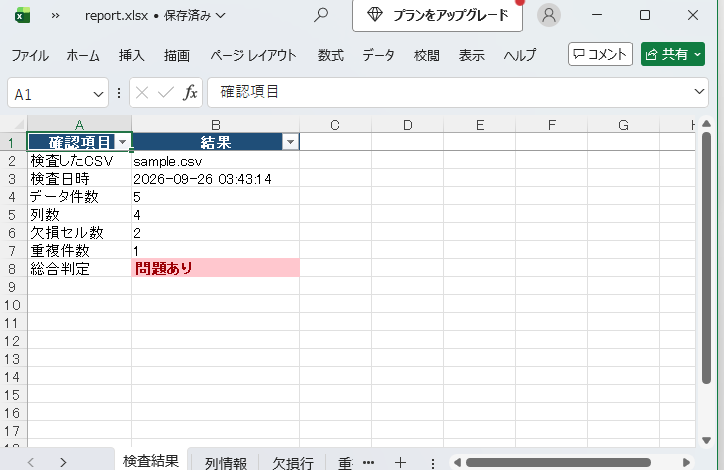

# CSVチェッカー(CSV Checker)

旧称:CSV Quality Report Tool(GitHubのリポジトリ名は`csv-quality-report-tool`のままです)。

[](https://github.com/ruru105/csv-quality-report-tool/actions/workflows/main.yml)

CSVファイルを自動検査し、データ品質の確認結果を見やすいExcelレポートとして出力するPythonツールです。

CSVを整形する `csv_clean.py` も同梱しています(下の「CSVを整形する」を参照)。

---

## 目次

- [主な機能](#主な機能)
- [判定ルール](#判定ルール)
- [欠損セル数・重複件数の数え方(サンプルの例)](#欠損セル数重複件数の数え方サンプルの例)
- [入力ファイル](#入力ファイル)
- [出力ファイル](#出力ファイル)
- [出力例](#出力例)
- [動作環境](#動作環境)
- [インストール](#インストール)
- [使い方(csv_report.py)](#使い方csv_reportpy)
- [検査ルールを設定ファイルで指定する(--config)](#検査ルールを設定ファイルで指定する--config)
- [フォルダの中のCSVをまとめて検査する(--folder)](#フォルダの中のcsvをまとめて検査する--folder)
- [CSVを整形する(csv_clean.py)](#csvを整形するcsv_cleanpy)
- [自動テスト](#自動テスト)
- [現在の制限](#現在の制限)

---

## 主な機能

- データ件数と列数の集計
- 欠損セル数の確認
- 重複行数の確認
- 各列のデータ型を確認
- 各列の有効データ数を集計
- 各列の欠損数を集計
- 各列のユニーク数を集計
- 欠損を含む行を抽出
- 重複している行を抽出
- 検査結果をExcel形式で出力
- UTF-8 / Windows系CSV文字コードに対応
- カンマ区切り以外(タブ・セミコロン・パイプ区切り)のファイルも自動で判定
- 設定ファイル(JSON)で、必須列・欠損を許さない列・重複を判定する列を指定して検査
- フォルダの中のCSVをまとめて検査し、CSVごとのExcelと、全CSVの判定を1枚にまとめた一覧(summary.xlsx)を作成

---

## 判定ルール

以下のどちらかに該当する場合、総合判定を「問題あり」とします。

- 欠損セル数が1件以上
- 重複行数が1件以上

欠損セルと重複行がともに0件の場合は「問題なし」と判定します。

---

## 欠損セル数・重複件数の数え方(サンプルの例)

付属の `sample.csv` は、次の5行(見出しを除く)のデータです。

| employee_id | name | department | hours_worked |
|---|---|---|---|
| 1001 | Aoki | Care | 8 |
| 1002 | Sato | Office | 7.5 |
| 1003 | Tanaka | (空欄) | 8 |
| 1002 | Sato | Office | 7.5 |
| 1004 | Suzuki | Care | (空欄) |

- **欠損セル数 = 2**:空欄のセルの数です。Tanakaの `department` と、Suzukiの `hours_worked` の2か所です。
- **重複件数 = 1**:同じ内容の行が2回出てくるとき、2回目のぶんを1件と数えます。この例では、1002のSatoの行が2回あるので1件です。
- レポートの「重複行」シートには、同じ内容の行が、両方(この例では2行)表示されます。件数(1)と表示される行数(2)が違うのは、このためです。
- 重複や欠損は、CSVに書かれた**文字のまま**で比べます。そのため、`007`と`7`のように先頭の0がある値は、別の値として扱い、重複には数えません。`1`と`1.0`のように書き方が違う値も、別の値になります。
- 先頭に0がある値(IDや郵便番号など)を含む列は、「元データ」シートでも`007`のまま保存します(文字として扱うため、その列のデータ型は文字になります)。ほかの列は、これまでどおり数値として保存します。

---

## 入力ファイル

検査したいCSVは、実行するときにファイル名を指定して選べます(下の「使い方」を参照)。

何も指定しなかったときは、プロジェクトフォルダ内の以下のCSVを読み込みます。

`sample.csv`

### 区切り文字について

基本はカンマ(,)区切りのCSVを想定していますが、FX取引ソフトの出力など、タブ・セミコロン(;)・パイプ(|)で区切られたファイルを指定したときも、自動で判定して正しく列を分けます。区切り文字を意識せず、そのまま指定して大丈夫です。

---

## 出力ファイル

実行すると、Excelファイルを作成します。ファイル名を指定しなかったときは、次の名前で作成します。

`report.xlsx`

出力するファイル名も、実行するときに指定できます(下の「使い方」を参照)。

Excelレポートには次の5シートを出力します。

| シート名 | 内容 |
|---|---|
| 検査結果 | 検査したCSV、検査日時、データ件数、列数、欠損セル数、重複件数、総合判定 |
| 列情報 | 各列のデータ型、有効データ数、欠損数、ユニーク数 |
| 欠損行 | 欠損値を含む行 |
| 重複行 | 重複している行 |
| 元データ | 読み込んだCSVの全データ |

Excelはヘッダー装飾、ウィンドウ固定、オートフィルタ、列幅調整を行い、確認しやすい形式で出力します。「検査結果」シートの総合判定は、「問題あり」は赤系、「問題なし」は緑系の色を付けて、ひと目で分かるようにしています。

---

## 出力例



---

## 動作環境

- Python 3.14.7
- pandas 3.0.5
- openpyxl 3.1.5

---

## インストール

このフォルダで次のコマンドを実行します。

```bash
python -m pip install -r requirements.txt
```

---

## 使い方(csv_report.py)

### 基本の使い方

#### 何も指定しない場合

付属の `sample.csv` を検査します。

```bash
python csv_report.py
```

数秒で終わり、次のように表示されます(付属のサンプルデータの場合)。

```text
完了：report.xlsx を作成しました。
データ件数=5 / 欠損セル数=2 / 重複件数=1 / 判定=問題あり
```

同じフォルダに `report.xlsx` が作成されます。

#### 検査するCSVを指定する場合

CSVのファイル名を、コマンドの後ろに書きます。

```bash
python csv_report.py 顧客一覧.csv
```

ファイル名に空白が含まれるときや、別のフォルダにあるCSVを指定するときは、全体を引用符(")で囲みます。

```bash
python csv_report.py "data/顧客 一覧.csv"
```

#### 作成するExcelの名前を指定する場合

`-o` の後ろに、作りたいExcelのファイル名を書きます。

```bash
python csv_report.py 顧客一覧.csv -o 結果.xlsx
```

### うまくいかないとき(エラーになる場合)

#### 指定したCSVが見つからない場合

次のように表示され、Excelは作成されません。

```text
エラー：nothing.csv が見つかりません。
```

#### 指定したCSVが空だった場合

次のように表示され、Excelは作成されません。

```text
エラー：empty.csv にデータがありません。
```

#### 保存先に、検査するCSVと同じ名前を指定した場合

検査するCSVをExcelで上書きしてしまわないように、エラーにして止まります。パスの書き方が違っても(`./`を付ける、フォルダをたどるなど)、同じファイルを指していれば止めます。

```text
エラー：保存先が、検査するCSVと同じです。元のファイルを書き換えないように、別の名前を指定してください。
```

#### 指定したCSVの形式が壊れている場合

行によって列の数が違うなど、形式が壊れたCSVを指定したときも、次のように表示され、Excelは作成されません。

```text
エラー：broken.csv を読み込めませんでした。(Error tokenizing data. C error: Expected 2 fields in line 3, saw 3)
```

---

## 検査ルールを設定ファイルで指定する(--config)

何も指定しないときは、すべての列について「欠損があるか」「行全体が同じ行があるか」を調べます。実際のデータでは、「このCSVではIDと名前は必ずほしい」「メモ欄は空欄でよい」「重複は、行全体ではなくIDだけで見たい」といった違いがあるため、検査のルールをJSONファイルに書いて指定できます。付属の `rules.example.json` が見本です。

```json
{
  "required_columns": ["employee_id", "name"],
  "not_null_columns": ["employee_id", "name"],
  "unique_columns": ["employee_id"]
}
```

| 項目 | 意味 | 省略したとき |
|---|---|---|
| `required_columns` | CSVにその列がなければ「問題あり」 | 調べない |
| `not_null_columns` | その列に空欄があれば「問題あり」 | すべての列を調べる |
| `unique_columns` | その列の組み合わせが同じ行を重複とみなし、あれば「問題あり」(`007` と `7` は別の値として扱う) | 行全体が同じものを重複とする |

使い方は、`-c`(`--config`)で設定ファイルを指定します。

```bash
python csv_report.py sample.csv -c rules.example.json
```

```text
完了：report.xlsx を作成しました。
ルール OK：必須列(employee_id、name) すべてあります
ルール OK：欠損を許さない列(employee_id、name) 欠損はありません
ルール NG：重複を判定する列(employee_id) 重複件数 1(重複している行は2行)
データ件数=5 / 欠損セル数=2 / 重複件数=1 / 判定=問題あり
```

設定ファイルを指定したときの違いは次のとおりです。

- 総合判定は、ルールに違反したかどうかで決まります。「欠損セル数」「重複件数」は、ルールとは関係なくCSV全体の数字をそのまま表示します(上の例では、ルール対象外の `department` や `hours_worked` の空欄は欠損セル数に数えられますが、判定には使いません)
- Excelに「ルール判定」シートが増え、ルールごとに OK / NG と内容(欠損の列別の数、ない列の名前など)が出ます。「検査結果」シートには、使った設定ファイル名とルール違反数が加わります
- 「欠損行」「重複行」のシートも、ルールの対象にした列で抽出します
- 設定ファイルに書いた列がCSVにない場合は、エラーで止めず、そのルールを NG として内容に書きます
- 設定ファイルの書き方が正しくない場合(JSONとして読めない・未対応の項目名・列名の並べ方が違う)は、エラーを表示し、Excelは作りません。項目名の綴り違いが黙って無視されないよう、使える項目以外はエラーにしています

設定ファイルを指定しなければ、これまでと完全に同じ動きと出力です(「ルール判定」シートは増えません)。

---

## フォルダの中のCSVをまとめて検査する(--folder)

毎日・毎月たくさんのCSVが届くような場面では、1つずつ指定するのは大変です。`--folder` でフォルダを指定すると、その中の `.csv` をすべて検査します。

```bash
python csv_report.py --folder data
```

```text
問題あり  customers.csv(データ件数=5 / 欠損セル数=2 / 重複件数=1)
エラー  empty.csv：data/empty.csv にデータがありません。
問題なし  orders.csv(データ件数=2 / 欠損セル数=0 / 重複件数=0)
完了：3件を検査しました(問題なし=1 / 問題あり=1 / エラー=1)。
一覧：reports/summary.xlsx
```

`reports` フォルダ(`-o` で別の名前を指定できます)に、次のファイルが作られます。

| ファイル | 内容 |
|---|---|
| `summary.xlsx` | 全CSVの判定を1枚にまとめた一覧。「全体結果」シート(CSVの数・問題なし/問題あり/エラーの数)と、「一覧」シート(ファイルごとの判定・件数・レポートのファイル名・エラーの内容)。判定のセルは、問題あり=赤系、問題なし=緑系、エラー=黄色で色分け |
| `<CSV名>_report.xlsx` | CSVごとのレポート。1つのCSVを検査したときと同じ内容(5シート。`-c` を使えば「ルール判定」シートも加わる) |

設定ファイル(`-c`)も一緒に使えます。すべてのCSVに同じルールを当て、「一覧」シートに「ルール違反数」の列が加わります。

```bash
python csv_report.py --folder data -c rules.example.json -o reports
```

動作の決まりは次のとおりです。

- 対象は、指定したフォルダ直下の `.csv`(大文字小文字は問いません)です。サブフォルダの中、`.csv` 以外のファイルは対象外です
- 空のCSVや壊れたCSVがあっても、止まらずに残りを検査します。検査できなかったCSVは、一覧に「エラー」と理由を載せ、レポートは作りません
- 終了コードは、すべて検査できたとき0、検査できなかったCSVがあるとき1です。「問題あり」の判定は、1つずつ検査するときと同じく、終了コードには影響しません
- 結果を入れるフォルダは、なければ作ります。CSVそのものは書き換えません
- `--folder` と、CSVファイルの指定は同時に使えません。フォルダが見つからない・フォルダに `.csv` がない場合は、エラーを表示して終了します(何も作りません)
- 設定ファイルの書き方が正しくない場合は、検査を始める前にエラーで止まります

---

## CSVを整形する(csv_clean.py)

`csv_clean.py` は、CSVを次の内容で整形して、別のCSVとして保存するツールです。

- 見出しとセルの前後の空白(全角の空白を含む)を消します
- 完全に同じ内容になった行を、最初の1行だけ残して取り除きます
- 指定した列名を削除します(`--drop`)
- 指定した条件に完全に一致する行だけ残します(`--where`)

元のCSVは書き換えません。整形した結果は、必ず別のファイルに保存します。数字は文字のまま扱うため、`007` のような値が `7` に変わることはありません。空欄も、そのまま空欄で残します。

### 基本の使い方

#### 何も指定しない場合

```bash
python csv_clean.py 顧客一覧.csv
```

同じフォルダに `cleaned.csv` が作成されます。

#### 保存するCSVの名前を指定する場合

`-o` の後ろに、作りたいCSVのファイル名を書きます。

```bash
python csv_clean.py 顧客一覧.csv -o 整形後.csv
```

実行すると、次のように表示されます。

```text
完了：整形後.csv を作成しました。
データ件数=4→3 / 空白を消した箇所=2 / 取り除いた重複行=1
```

### オプション(--where・--drop)

#### 条件で行を絞り込む場合(--where)

`--where` の後ろに「列名=値」の形で条件を書きます。指定した値と**完全に一致する行だけ**を残します(部分一致では絞り込みません)。

```bash
python csv_clean.py 顧客一覧.csv --where 部署=Care
```

条件に一致する行が1件もなかったときは、エラーにせず、見出しだけのCSVを作成します。

列名の指定が間違っているとき(CSVにない列名を指定したときや、「列名=値」の形になっていないとき)は、エラーを表示して止まります。CSVは作成されません。

```text
エラー：列名「部門」がCSVに見つかりません。
```

#### 不要な列を削除する場合(--drop)

`--drop` の後ろに、削除したい列名を書きます。複数の列を削除したいときは、カンマ(,)で区切って指定します。

```bash
python csv_clean.py 顧客一覧.csv --drop 備考,メモ
```

CSVにない列名を指定したときや、すべての列を削除しようとしたときは、エラーを表示して止まります。CSVは作成されません。

```text
エラー：次の列名がCSVに見つかりません：メモ
```

```text
エラー：すべての列を削除することはできません。
```

#### --where と --drop を組み合わせる場合

`--where` で絞り込んだあとに、`--drop` でその条件に使った列を削除することもできます。

```bash
python csv_clean.py 顧客一覧.csv --where 部署=Care --drop 部署
```

### うまくいかないとき(エラーになる場合)

#### 保存先に、整形するCSVと同じ名前を指定した場合

元のファイルを書き換えないように、エラーにして止まります。

```text
エラー：保存先が、整形するCSVと同じです。元のファイルを書き換えないように、別の名前を指定してください。
```

#### 指定したCSVが見つからない場合

次のように表示され、CSVは作成されません。

```text
エラー：nothing.csv が見つかりません。
```

---

## 自動テスト

pytestを使用した自動テストを実装しています。

以下の内容を自動確認します。

- UTF-8形式のCSVを正しく読み込めること
- CP932形式のCSVを正しく読み込めること
- Excelレポートが正常に生成されること
- 5つのシートが正しく作成されること
- データ件数、欠損セル数、重複件数、総合判定が期待値と一致すること
- 検査するCSVと出力するExcelの名前を、指定して実行できること
- 存在しないCSV・空のCSV・形式が壊れたCSVを指定したとき、エラーを表示し、Excelを作成しないこと
- 保存先に検査するCSVと同じファイル(書き方が違うもの・別名のリンクを含む)を指定したとき、エラーを表示し、元のCSVを書き換えないこと
- 先頭に0がある値(`007`)を、元データ上で消さず、`7`と別の値として扱い、重複に数えないこと(本当に同じ行は、これまでどおり重複に数えること)
- 「検査結果」シートに、検査したCSVのファイル名と検査日時が表示されること
- 日本語の列見出しでも、列の幅が十分に取られて見切れないこと
- 総合判定が「問題あり」のときは赤系、「問題なし」のときは緑系の色が付くこと
- タブ・セミコロン区切りのファイルでも、正しく列を分けて読み込めること
- 区切り文字を含まない、もともと1列だけのCSVを誤って分割しないこと
- 設定ファイル(`--config`)で、必須列・欠損を許さない列・重複を判定する列を指定でき、ルール違反を「問題あり」と判定し、「ルール判定」シートに理由を出すこと
- 設定ファイルが読めない・書き方が違うときに、エラーを表示し、Excelを作らないこと(設定ファイルなしの出力は、従来と変わらないこと)
- `--folder` で、フォルダ直下の `.csv`(大文字小文字を問わず)だけを検査し、サブフォルダや `.csv` 以外は対象にしないこと
- `--folder` で、CSVごとのExcelと、全CSVの判定を1枚にまとめた `summary.xlsx` を作ること(判定・件数・エラーの理由が一覧に載ること)
- `--folder` で、空のCSVや壊れたCSVがあっても残りの検査を続け、終了コードを1にすること
- `--folder` で、フォルダがない・`.csv` がない・CSVファイルと同時に指定した場合にエラーを表示すること
- 最初のデータ行が見出しより列が多い壊れたCSVを、Tracebackで止まらず、エラーとして扱うこと
- csv_clean.pyが、前後の空白を消し、完全に同じ行を取り除けること
- csv_clean.pyが、数字を文字のまま扱い、空欄を空欄のまま残すこと
- csv_clean.pyが、保存先を指定できること
- csv_clean.pyが、元のCSVを書き換えないこと
- csv_clean.pyが、存在しないCSV・空のCSV・保存できない保存先のとき、エラーを表示すること
- csv_clean.pyが、--where で指定した条件に完全一致する行だけ残せること(部分一致は含めないこと)
- csv_clean.pyが、--where で一致する行がないとき、エラーにせず見出しだけのCSVを作成すること
- csv_clean.pyが、--drop で指定した列(複数可)を削除できること
- csv_clean.pyが、--where・--drop で存在しない列名を指定したとき・すべての列を削除しようとしたときに、エラーを表示すること
- csv_clean.pyが、--where と --drop を組み合わせて使えること
- csv_clean.pyが、タブ・セミコロン区切りのファイルでも、正しく列を分けて整形できること

テストは次のコマンドで実行できます。

```bash
python -m pytest
```

現在のテスト結果：

```text
83 passed
```

(2026-10-05 に確認)

---

## 現在の制限

- サンプルのデータはすべて架空です。実在の人物・組織のデータではありません。
- 設定ファイル(`--config`)は csv_report.py だけで使えます。csv_clean.py では使えません。また、設定できるのは「必須列」「欠損を許さない列」「重複を判定する列」の3つで、値の範囲(数値の上限・下限)や形式(日付・メールアドレス)のルールには対応していません。
- `--folder` は csv_report.py だけで使えます。csv_clean.py では使えません。CSVは1つずつ順に検査するため、大きなCSVがたくさんあると時間がかかります。
